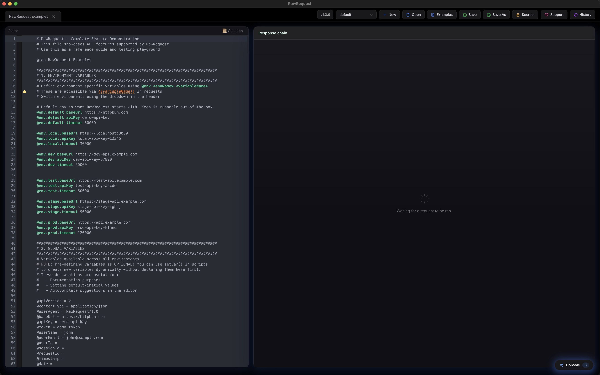
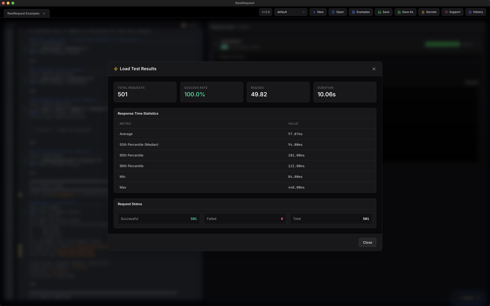

# RawRequest

A modern, lightweight HTTP client for developers. Built with [Wails](https://wails.io/) and Angular.

## Screenshots






## Features

- 📝 **HTTP File Format** - Use `.http` files with syntax highlighting
- 🔗 **Request Chaining** - Chain requests with `@depends`
- ⚡ **Load Testing** - Built-in load testing with `@load`
- 🔐 **Secrets Management** - Encrypted vault for sensitive data
- 🌍 **Environments** - Switch between dev, staging, prod
- 📜 **Pre/Post Scripts** - JavaScript pre/post blocks for dynamic requests

## Installation

### macOS

#### Quick Install (Recommended)
```bash
curl -fsSL https://raw.githubusercontent.com/portablesheep/RawRequest/main/scripts/install.sh | bash
```

#### Homebrew
```bash
# Tap this repository
brew tap portablesheep/rawrequest https://github.com/portablesheep/homebrew-rawrequest

# Install
brew install --cask rawrequest

# Link to Applications (optional)
ln -sf $(brew --prefix)/opt/rawrequest/RawRequest.app /Applications/
```

#### Manual Install
1. Download the latest macOS artifact from [Releases](https://github.com/portablesheep/RawRequest/releases) (e.g. `.dmg` or `RawRequest-v*-macos-universal.tar.gz`)
2. Open the DMG and drag RawRequest to Applications, or extract the tarball
3. On first launch, right-click and select "Open" to bypass Gatekeeper

### Windows

1. Download `RawRequest-*-windows-portable.zip` from [Releases](https://github.com/portablesheep/RawRequest/releases)
2. Extract to any folder
3. Run `RawRequest.exe`
4. If SmartScreen warns you, click "More info" → "Run anyway"

## Quick Start

Create a file called `requests.http`:

```http
# Environment variables
@env.dev.baseUrl = http://localhost:3000
@env.prod.baseUrl https://api.example.com

# Optional globals (useful for defaults + autocomplete)
@contentType = application/json

### Simple GET request
GET {{baseUrl}}/users
Accept: application/json

### POST with JSON body
POST {{baseUrl}}/users
Content-Type: application/json

{
  "name": "John Doe",
  "email": "john@example.com"
}

### Request with pre/post scripts
@name login
@timeout 15000
POST {{baseUrl}}/auth/login
Content-Type: {{contentType}}

{
  "username": "admin",
  "password": "{{secret:password}}"
}

> {
  assert(response.status === 200, `Expected 200, got ${response.status}`);
  setVar('token', response.json.token);
  console.log('Logged in!');
}

### Chained request (runs after login)
@name getProfile
@depends login
GET {{baseUrl}}/profile
Authorization: Bearer {{token}}
```

Notes:
- Env vars support either whitespace or an equals sign (e.g. `@env.dev.baseUrl https://...` or `@env.dev.baseUrl = https://...`).
- Assertions are done in scripts via `assert(...)`.

## Documentation

See the [examples.http](./examples/examples.http) file to see how features can be used.

## Development

### Prerequisites
- Go 1.24+
- Node.js 20+
- [Wails CLI](https://wails.io/docs/gettingstarted/installation)

### Build from Source
```bash
# Install dependencies
cd frontend && npm install && cd ..

# Development mode
wails dev
```

## License

PolyForm Noncommercial License 1.0.0 - see [LICENSE](./LICENSE)
