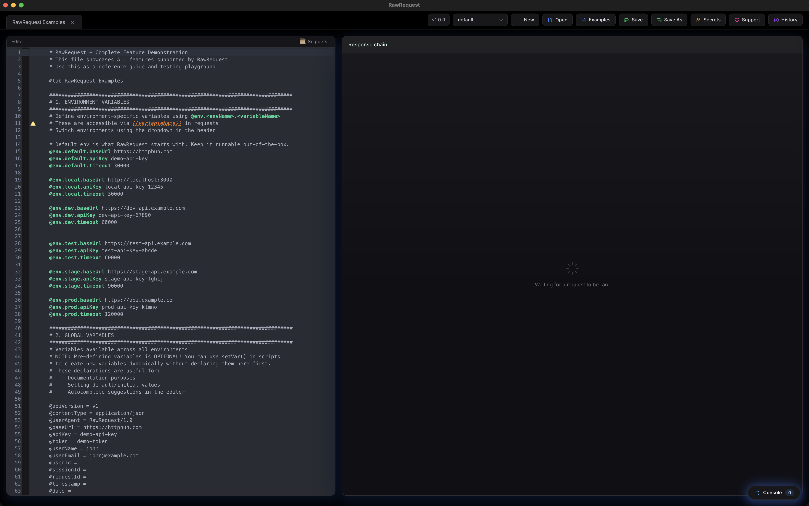
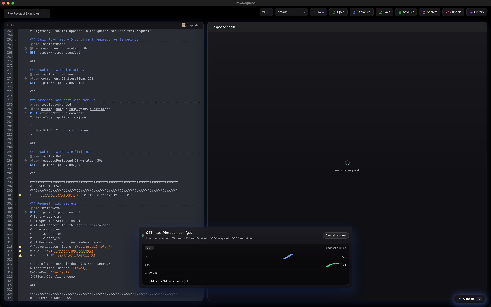
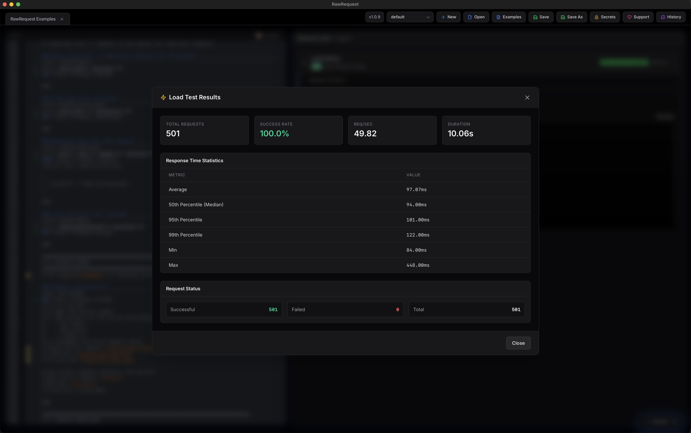

# RawRequest

RawRequest is a code-first desktop HTTP client.

Write requests in `.http` files, run them with environment variables and secrets, add small JavaScript scripts where needed, and keep history/results alongside your work. Control it from the GUI, the CLI, or let an AI drive it via MCP.

Built with [Wails](https://wails.io/) and Angular.

## Screenshots







## Features

- **Code-first editor**: CodeMirror 6 with syntax highlighting, folding, linting, and variable diagnostics
- **Request navigation**: outline panel (<kbd>⌘ Shift O</kbd>) and command palette (<kbd>⌘ P</kbd>) for quick access to any request
- **CLI mode**: run named requests from the terminal for scripting/CI
- **MCP server**: let AI assistants (Copilot, Claude) discover and execute requests via chat
- **Request chaining**: chain requests with `@depends` and reference prior responses
- **Load testing**: built-in load testing with `@load` — RPS limiting, ramp-up, percentile breakdowns
- **Secrets**: encrypted vault with `{{secret:key}}` placeholders, sortable manager with usage tracking
- **Environments**: switch between dev/staging/prod via `@env.*` variables
- **Scripts**: JavaScript pre/post blocks for dynamic requests, variable extraction, and assertions
- **OAuth2**: `@auth oauth2` directive with automatic token management

## Installation

### macOS

#### Quick Install (Recommended)
```bash
curl -fsSL https://raw.githubusercontent.com/portablesheep/RawRequest/main/scripts/install.sh | bash
```

#### Homebrew
```bash
# Tap this repository
brew tap portablesheep/rawrequest https://github.com/portablesheep/homebrew-rawrequest

# Install
brew install --cask rawrequest

# Link to Applications (optional)
ln -sf $(brew --prefix)/opt/rawrequest/RawRequest.app /Applications/
```

#### Manual Install
1. Download the latest macOS artifact from [Releases](https://github.com/portablesheep/RawRequest/releases) (e.g. `.dmg` or `RawRequest-v*-macos-universal.tar.gz`)
2. Open the DMG and drag RawRequest to Applications, or extract the tarball
3. On first launch, right-click and select "Open" to bypass Gatekeeper

### Windows

1. Download `RawRequest-*-windows-portable.zip` from [Releases](https://github.com/portablesheep/RawRequest/releases)
2. Extract to any folder
3. Run `RawRequest.exe`
4. If SmartScreen warns you, click "More info" → "Run anyway"

## Quick Start

Create a file called `requests.http`:

```http
# Environment variables
@env.dev.baseUrl = http://localhost:3000
@env.prod.baseUrl = https://api.example.com

# Optional globals (useful for defaults + autocomplete)
@contentType = application/json

### Simple GET request
GET {{baseUrl}}/users
Accept: application/json

### POST with JSON body
POST {{baseUrl}}/users
Content-Type: application/json

{
  "name": "Example User",
  "email": "example@company.test"
}

### Request with pre/post scripts
@name login
@timeout 15000
POST {{baseUrl}}/auth/login
Content-Type: {{contentType}}

{
  "username": "admin",
  "password": "{{secret:password}}"
}

> {
  assert(response.status === 200, `Expected 200, got ${response.status}`);
  setVar('token', response.json.token);
  console.log('Logged in!');
}

### Chained request (runs after login)
@name getProfile
@depends login
GET {{baseUrl}}/profile
Authorization: Bearer {{token}}
```

Notes:
- Env vars support either whitespace or an equals sign (e.g. `@env.dev.baseUrl https://...` or `@env.dev.baseUrl = https://...`).
- Assertions are done in scripts via `assert(...)`.

## CLI Mode

RawRequest can also run from the command line for scripting, automation, and CI pipelines:

```bash
# Run a named request
rawrequest run requests.http -n login

# Use a specific environment
rawrequest run requests.http -n getUsers -e prod

# Set variables from the command line
rawrequest run requests.http -n createUser -V "username=john" -V "email=john@example.com"

# Output formats: json, body, full, quiet
rawrequest run requests.http -n getData -o body | jq .

# List all requests in a file
rawrequest list requests.http

# List available environments
rawrequest envs requests.http
```

Run `rawrequest help` for full usage details.

## MCP Server (AI Assistant Integration)

RawRequest can act as an [MCP](https://modelcontextprotocol.io) server, allowing AI assistants like GitHub Copilot, Claude, and others to discover and execute HTTP requests from your `.http` files via chat.

### Setup

Configure your AI client to use RawRequest as an MCP server. The server uses stdio transport — no ports or HTTP endpoints needed.

**VS Code / GitHub Copilot** (`.vscode/mcp.json`):
```json
{
  "servers": {
    "rawrequest": {
      "type": "stdio",
      "command": "rawrequest",
      "args": ["mcp"]
    }
  }
}
```

**Claude Desktop** (`claude_desktop_config.json`):
```json
{
  "mcpServers": {
    "rawrequest": {
      "command": "rawrequest",
      "args": ["mcp"]
    }
  }
}
```

You can optionally set a default environment: `"args": ["mcp", "--env", "dev"]`

### Available Tools

| Tool | Description |
|------|-------------|
| `list_requests` | List all requests in a `.http` file (name, method, URL, group) |
| `run_request` | Execute a named request and return the full response |
| `list_environments` | Show available environments and their variables |
| `set_variable` | Set a variable for use in subsequent requests |

### Telling the AI about your files

Add a note in your project's `copilot-instructions.md`, `claude.md`, or similar:

```markdown
## API Testing
Use the RawRequest MCP server to run HTTP requests.
The API definitions are in `api.http`. Use the "dev" environment.
```

### Secrets

The MCP server can resolve `{{secret:KEY}}` placeholders using the same encrypted vault as the GUI (stored at `~/.config/rawrequest/secrets/`). Set up secrets in the GUI first, then they work automatically in MCP mode.

## Documentation

- The landing page lives in [docs/index.html](./docs/index.html).
- See [examples/http](./examples/examples.http) for a bigger request file.

## Development

### Prerequisites
- Go 1.24+
- Node.js 20+
- [Wails CLI](https://wails.io/docs/gettingstarted/installation)

### Build from Source
```bash
# Install dependencies
cd frontend && npm install && cd ..

# Development mode
wails dev
```

## License

PolyForm Noncommercial License 1.0.0 - see [LICENSE](./LICENSE)
